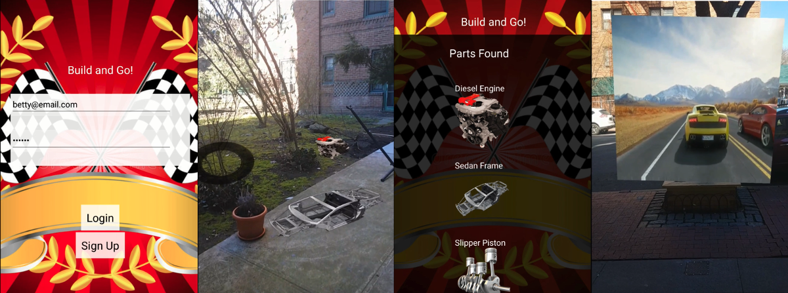

# BuildAndGo

BuildAndGo is an augmented reality mobile game for Android and iOS X. Search the world for parts until you find everything you need to build your very own car. Once your car is complete, race to become the new BuildAndGo champion.

## Technologies
Build and Go was made using React Native as well as ViroMedia SDK for augmented reality, React Navigation for app navigation, and Redux to store state.

Our backend server was made using Node.js, Express, and Sequelize with PostgreSQL and was deployed to Heroku for remote access. Images for parts are hosted by AWS.

## Screenshots


### Android
Requirements:
An ARCore compatible device - you can find a list of them here:
[ARCore Supported Devices](https://developers.google.com/ar/discover/supported-devices)

You can download the apk here: [BuildAndGo](https://www.dropbox.com/s/5pgagv73mw5hjjy/app-ar-release.apk?dl=0)

### iOS
BuildAndGo will work on iPhones with iOS 11+, but was built for Android. Because of this, the best visual experience will be on Android devices.

Clone this repo install dependences, and link font to React-Native with the following:
```
> npm install
> react-native link
```

To run the app on your phone, complete the following steps:
1. Download ViroMedia from your app store
2. Run the following from your terminal in the BuildAndGo directory:
```
> npm start
```
3. Open the ViroMedia app on your phone and click the hamburger menu on top left
4. Click </> Enter Testbed, input the ngrok code generated in your terminal, and click Go to start the app.

### Android Emulator
If you're running on an android emulator, select the following device parameters for the best experience:
Phone: Pixel or Pixel2
Release Name: Oreo
API level: 27
Android Version: 8.1
System Image x86

Please note that AR for this app is not available through Android Studio at this time.

## Contributors

* [Ana Sanchez](https://github.com/anacsanchez)
* [Danielle Howard](https://github.com/danielleh)
* [Eunji Song](https://github.com/eunjisong)
* [Sarah Wooten](https://github.com/snwooten)

